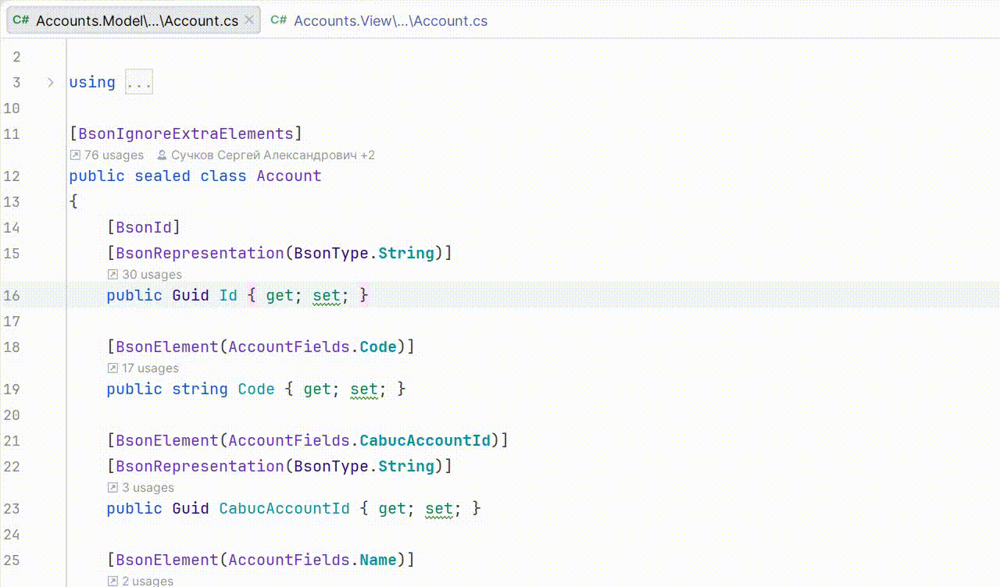

# AutoMapper.FindUsage for Rider and ReSharper

[](https://github.com/Backs/AutoMapper.FindUsage/actions/workflows/build.yml)
[](https://plugins.jetbrains.com/plugin/31907)
[](https://plugins.jetbrains.com/plugin/31908)

**AutoMapper.FindUsage** is a plugin for JetBrains Rider and ReSharper that provides seamless navigation between DTOs and Models based on your AutoMapper configurations.

## Features

- **Quick Navigation**: Jump from a property in your destination class directly to its source in the original model.
- **Fluent API Support**: Automatically recognizes mappings configured via `CreateMap<TSource, TDest>()`.
- **Reverse Mapping**: Full support for `.ReverseMap()`, allowing you to navigate in both directions.
- **Clean UI**: Context actions appear only on `set` or `init` accessors to minimize visual noise in your `Alt+Enter` menu.
- **Smart Grouping**: If a property is mapped from/to multiple types, the plugin groups them and uses full type names for easy identification.

## Usage

1. Open a C# file containing a class used in AutoMapper mappings.
2. Place the caret on the `set` or `init` accessor of a property.
3. Press `Alt + Enter` to open Context Actions.
4. Select **AutoMapper. Navigate to source: <Type>.<Property>** to jump to the corresponding member.



## Supported Configurations

The plugin analyzes your codebase to find various mapping patterns:

```csharp
// Standard mapping
CreateMap<User, UserDto>();

// Reverse mapping support
CreateMap<Order, OrderDto>().ReverseMap();
```

## Installation

You can install the plugin directly from the [JetBrains Marketplace](https://plugins.jetbrains.com/plugin/31907-automapper-findusage).

## Development

To test the plugin in a sandbox environment:

1. **Build the .NET part**:
   ```bash
   .\gradlew.bat compileDotNet
   ```

2. **Launch Rider with the plugin**:
   ```bash
   .\gradlew.bat runIde
   ```
   *This will start an experimental instance of Rider with the plugin installed.*

3. **Verify functionality**:
   Open any solution with AutoMapper configurations and test the `Alt+Enter` menu on property setters.

## License

This project is licensed under the Apache License 2.0 - see the [LICENSE](LICENSE) file for details.

## Author

Created by [Sergey Rogatnev](https://github.com/Backs).
