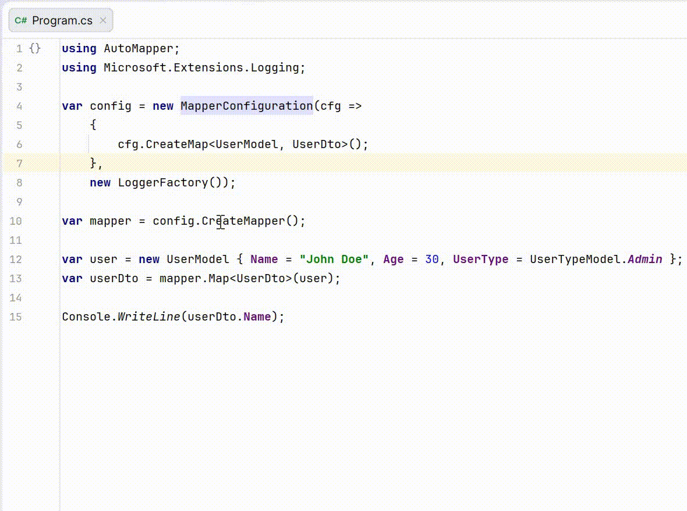
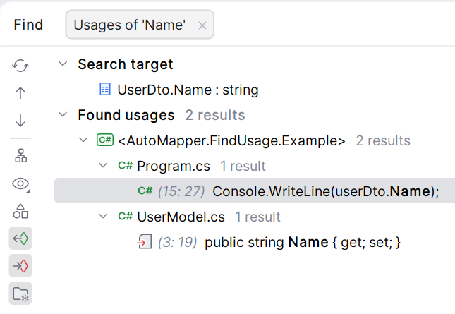

# AutoMapper.FindUsage for Rider and ReSharper

[](https://github.com/Backs/AutoMapper.FindUsage/actions/workflows/build.yml)
[](https://plugins.jetbrains.com/plugin/31907)
[](https://plugins.jetbrains.com/plugin/31908)

**AutoMapper.FindUsage** is a plugin for JetBrains Rider and ReSharper that provides seamless navigation between DTOs and Models based on your AutoMapper configurations.

## Features
- **Find Usages**: Deep integration with the standard Find Usages action in Rider and ReSharper.
- **Quick Navigation**: Seamlessly jump between source and destination properties.
- **Fluent API Support**: Automatically recognizes mappings configured via `CreateMap<TSource, TDest>()`.
- **Bidirectional Mapping**: Full support for `.ReverseMap()`. Navigation from Destination to Source always works, while Source to Destination navigation is available when a reverse mapping is defined.
- **Smart Grouping**: Mappings are grouped by type in the Find Results window for properties with multiple sources or destinations.

## Usage

1. Open a C# file containing a class used in AutoMapper mappings.
2. Place the caret on the `set` or `init` accessor of a property.
3. Run `Find Usages` action.
4. View the search result for source properties or jump to the corresponding member.



Find Results window:



## Supported Configurations

The plugin analyzes your codebase to find various mapping patterns:

```csharp
// Standard mapping (Destination -> Source navigation)
CreateMap<User, UserDto>();

// Reverse mapping support (Bidirectional navigation)
CreateMap<Order, OrderDto>().ReverseMap();

// Support for init accessors
public class UserDto { public string Name { get; init; } }
```

## Installation

You can install the plugin directly from the [JetBrains Marketplace](https://plugins.jetbrains.com/plugin/31907-automapper-findusage).

## Development

To test the plugin in a sandbox environment:

1. **Build the .NET part**:
   ```bash
   ./gradlew compileDotNet
   ```
   *(On Windows, use `.\gradlew.bat compileDotNet`)*

2. **Launch Rider with the plugin**:
   ```bash
   ./gradlew runIde
   ```
   *(On Windows, use `.\gradlew.bat runIde`)*
   *This will start an experimental instance of Rider with the plugin installed.*

3. **Verify functionality**:
   Open any solution with AutoMapper configurations and test the `Find Usages` action.

## License

This project is licensed under the Apache License 2.0 – see the [LICENSE](LICENSE) file for details.

## Author

Created by [Sergey Rogatnev](https://github.com/Backs).
